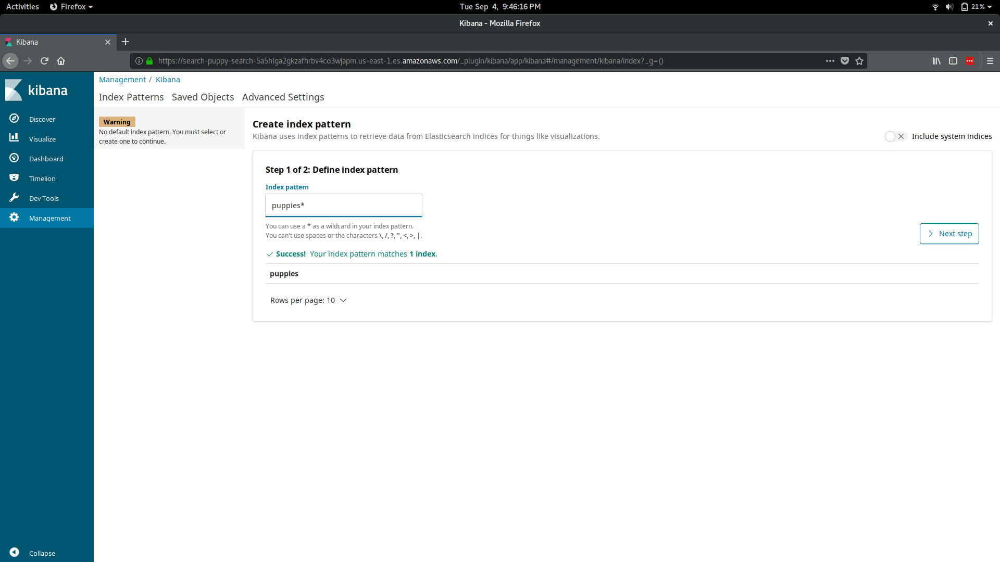
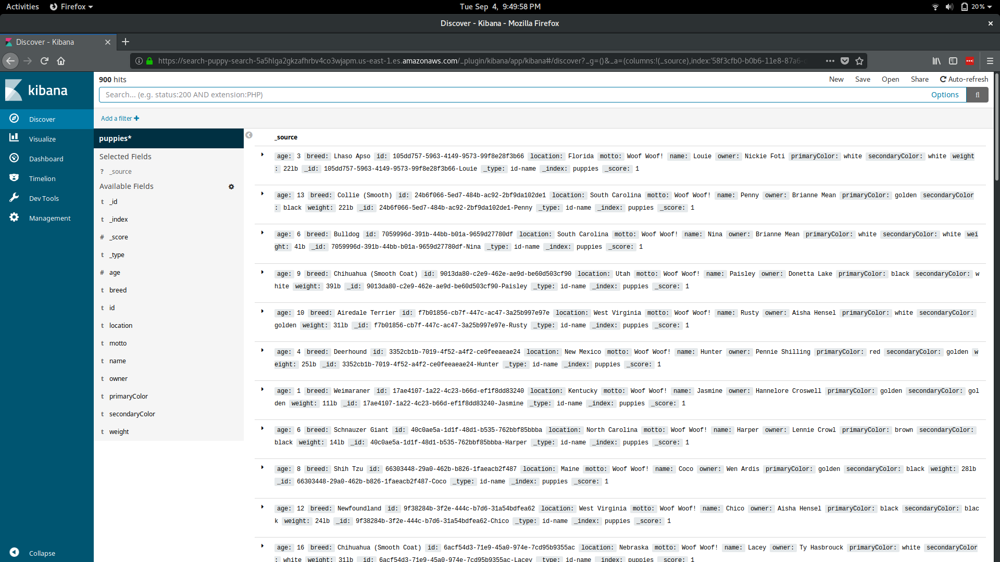

<!--
title: .'DynamoDB Stream To Elasticsearch'
description: 'Stream data from DynamoDB to Elasticsearch'
framework: v1
platform: AWS
language: Go
authorLink: 'https://github.com/jalie'
authorName: 'Jan Liesendahl'
authorAvatar: 'https://avatars0.githubusercontent.com/u/548657?v=4&s=140'
-->

# DynamoDB Stream To Elasticsearch 
## Deploying cloud information costs $$, Elasticsearch is not part of the free tier, as such please deploy with caution.

This serverless project acts as an example for:
* Creating a DynamoDB Table via Cloudformation
* Creating a single-node Elasticsearch Cluster via Cloudformation
* Creating a generic Go function which maps the keyspace from DynamoDB to Elasticsearch

As with all serverless projects, you must have severless installed! Listed here is a good way to get set up! 
[https://github.com/serverless/serverless#quick-start](https://github.com/serverless/serverless#quick-start)

Once you have serverless installed on your system run these commands to get the project set up.
```
cd aws-golang-dynamo-stream-to-elasticsearch
npm install
make
./node_modules/serverless/bin/serverless deploy 
# or if you've installed serverless globally 
# sls deploy
```

This particular example will take ~15 minutes to deploy (Elasticsearch takes some time).
Grab a coffee and sit back! <sup>1</sup>

<sup>1</sup>
In production the deployment of persistent data stores (dynamodb, rds variants, elasticsearch) 
should be decoupled from application code

## Seeding Your DynamoDB Table with Data
```
go run cmd/seed-dynamo/main.go --table-name="$YOUR_TABLE_NAME"
```

Once data is written to Dynamo, your lambda function will trigger the DynamoDB Stream events and data should begin to flow into Elasticsearch.

You should be able to create a Kibana index by navigating to your Kibana endpoint (found in the AWS Console) and clicking on the management tab. You should see something like this:



Follow the instructions to create the index, and you should now be able to query your data like so:




## Access Policy for Kibana
The Example itself is running without any further Policy definition, since the Lambda execution role has access to the ES endpoint.
However, if you want to access Kibana with your Browser - there is an additonal definition needed.

Possible restrictions can be done with aws cognito user auth, aws user auth, IP based or open access (not recommended):
e.g. with ip restriction:
```
        AccessPolicies:
          Version: "2012-10-17"
          Statement:
            -
              Effect: "Allow"
              Principal:
                AWS: "*"
              Action: "es:*"
              Resource: "*"
              Condition:
                IpAddress:
                  aws:sourceIp:
                    - "123.123.123.123"
```