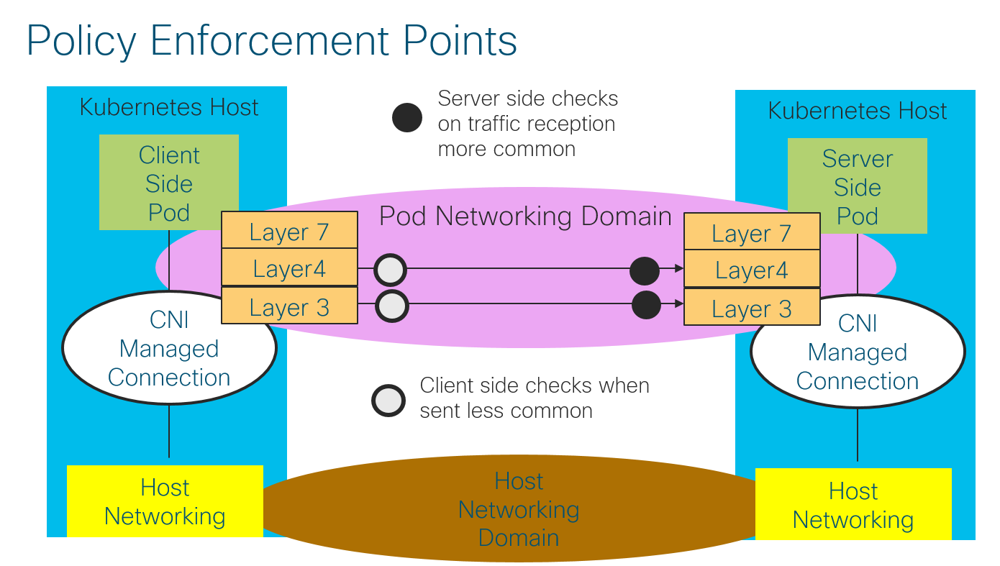

# Network Policy

This blog is about network policy in a Kubernetes environment with specific focus on
how network policy performs in a multicloud environment.  Network policy throughout
this blog is defined as a function to restrict traffic entering or exiting Kubernetes
pods or other network endpoints. The restrictions will be enforced at layer 3 or
Layer 4 of the Open Systems Interconnection (OSI) protocol stack.  Restrictions to
traffic entering pods or end points will be referred to as ingress policy while
restrictions to traffic exiting a pod or end point will be called egress policy.

# Kubernetes Network Policy API

The Kubernetes community has specified an API which defines the semantics of the
network policy functionality.  The community has described the concepts:
[Network Policy Concepts](https://kubernetes.io/docs/concepts/services-networking/network-policies/)
The full API definition is available:
[Network Policy API](https://kubernetes.io/docs/reference/generated/kubernetes-api/v1.12/#networkpolicy-v1-networking-k8s-io)
The Kubernetes community has only defined the API.  They do not define how the functionality
specified by the API should be implemented. Specifically, they do not define how or what
components should be used to enforce the restrictions specified by the API.  Although
not required by the API it is nearly generally accepted that Container Network
Interface (CNI) plugins will implement the policy enforcement.
CNI plugins do not universally use the same low level components
to match against the specified criteria and enforce the actions based on the match.
For example some CNIs use iptables to perform the required dataplane functions while
other CNIs use Open vSwitch (OvS).

# Vendor Specific Extensions and Integrations

Vendors offer extensions to Kubernetes network policy API to provide additional functionality.
Typically, these extensions allow more granular rules and the type of resources the rules
can be applied to.  A good example of this is
[Calico Networkpolicy](https://docs.projectcalico.org/v3.6/reference/calicoctl/resources/networkpolicy)
The Calico Networkpolicy API offers a superset of the functionality described by
the Kubernetes (K8s) API.  It uses completely different API objects, but
structured very similar to the K8s API objects.  It features:

* More complicated pod match semantics
* More complicated and explicit allow/deny rules
* More protocols supported (ICMP, ICMPv6, UDPLite)
* Supports applying rules to traffic from serviceAccount specific endpoints

The Cisco ACI team took a different approach.  The ACI team's approach is to allow the K8s
network policy to co-exist with the ACI's Endpoint Group (EPG) based policies. The user can use either API or
both APIs to express the policy and the ACI dataplane elements will enforce the policy even
if both are specified.   The ACI team uses annotations on K8s resources to allow the user to
easily specify how the K8s resources should be mapped to EPGs. More details on the
ACI approach can be found here:
[ACI + K8s Network Policy](https://www.cisco.com/c/en/us/td/docs/switches/datacenter/aci/apic/sw/kb/b_Kubernetes_Integration_with_ACI.html)

There are numerous other vendor specific network policy implementations available.  They include: 
Cillium, Contiv-VPP, Weave, Romana and others. This blog choose to focus on Calico because of
both its widespread industry adoption and its support in the Cisco Container Platform (CCP). 
The authors have not attempted to analyse all the implementations that support K8s network policy
but at a black-box level have found they mostly provide the same level of functionality.

# Calico Networkpolicy implementation overview

The Calico documentation
[Calico Architecture](https://docs.projectcalico.org/v3.6/reference/architecture/)
offers a more complete description of the Calico architecture but a few points are noted here
specific to the network policy implementation.   Since Calico has its own NetworkPolicy API,
which a superset of capabilities K8s network policy objects are actually represented as
Calico NetworkPolicy objects in its internal state.  As a superset Calico policy is able
to fully implement the Kubernetes NetworkPolicy API.  Users can use either or both APIs to
create network policies which can coexist. The two different policy objects can ordered to
convey precedence. Finally, the Calico CNI policy capability can be decoupled from the
inter-node K8s networking functionality.  This is important in an Amazon Web Services
(AWS) deployment because the AWS VPC CNI is used for the pod networking and inter-node
communication.

# Network Policy Graphic

**Figure 1.** Network policy enforcement points relative to the OSI layer 7 model 

To continue reading and learn about network policy 
[limitations](./README.md#limitations)
return to the main page.

# References 

* [Network Policy Concepts](https://kubernetes.io/docs/concepts/services-networking/network-policies/)

* [Network Policy API](https://kubernetes.io/docs/reference/generated/kubernetes-api/v1.12/#networkpolicy-v1-networking-k8s-io)

* [Calico Networkpolicy](https://docs.projectcalico.org/v3.6/reference/calicoctl/resources/networkpolicy)

* [ACI + K8s Network Policy](https://www.cisco.com/c/en/us/td/docs/switches/datacenter/aci/apic/sw/kb/b_Kubernetes_Integration_with_ACI.html)

* [Calico Architecture](https://docs.projectcalico.org/v3.6/reference/architecture/)
